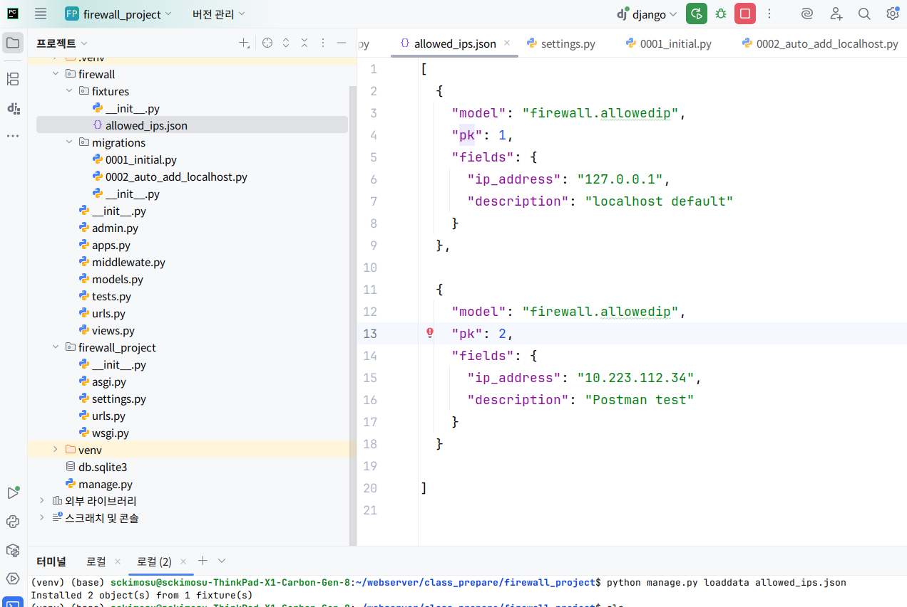
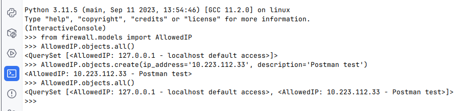
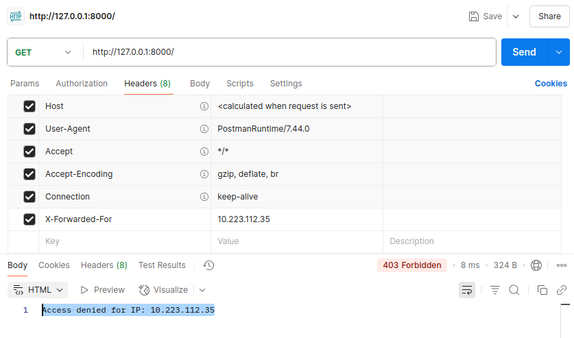

# [웹서버13] Django 방화벽(Firewall)

---

## 🔒 목표: IP 기반 방화벽 기능을 갖춘 Django 프로젝트 만들기

### ✅ 기능 요약

1. **화이트리스트 기반 접근 제어** (허용된 IP만 접근 가능)
2. **관리자 페이지에서 IP 목록 CRUD 관리**
3. 모든 요청 전 `Middleware`를 통해 검사
4. 로그 기록 (누가, 언제, 어떤 IP로 차단되었는지)

---

## 1. 프로젝트 생성

```bash
django-admin startproject firewall_project
cd firewall_project
python manage.py startapp firewall

```

---

- 앱 디렉토리 구

```

firewall_project/
├── firewall/
│   ├── models.py
│   ├── views.py
│   ├── middleware.py
│   └── ...
└── firewall_project/
    └── settings.py
```

## 🚀 가상환경 만들기

```bash

python3 -m venv venv
source venv/bin/activate
pip install django

```

## 2. 모델 정의: 허용된 IP 리스트

`firewall/models.py`:

```python
from django.db import models

class AllowedIP(models.Model):
    ip_address = models.GenericIPAddressField(unique=True)
    description = models.CharField(max_length=255, blank=True)

    def __str__(self):
        return f"{self.ip_address} - {self.description}"

```

```bash
python manage.py makemigrations
python manage.py migrate
```

---

- `return f"{self.ip_address} - {self.description}"`는 Django 모델 클래스의 `__str__` 메서드에서 흔히 사용되는 **문자열 포맷 반환 방식**
- 객체를 문자열로 표현할 때

---

## 🔍 전체 예시

```python
from django.db import models

class AllowedIP(models.Model):
    ip_address = models.GenericIPAddressField()
    description = models.CharField(max_length=100, blank=True)

    def __str__(self):
        return f"{self.ip_address} - {self.description}"

```

---

## ✅ 결과 예시

- 관리자 페이지나 셸에서 이 모델 인스턴스를 출력할 때 다음과 같이 표시됨

```python
>>> ip = AllowedIP(ip_address='192.168.0.1', description='로컬 테스트용')
>>> print(ip)
192.168.0.1 - 로컬 테스트용

```

---

## 🎯 왜 사용하는가?

- **admin 페이지**에서 `AllowedIP object (1)`처럼 보이지 않게 하고
- **디버깅 및 로그 출력** 시 객체를 읽기 쉽게 표현하고
- **select dropdown** 등에서 사람이 읽을 수 있는 값으로 보여주기 위함

---

## 3. 관리자 페이지 등록

`firewall/admin.py`:

```python
from django.contrib import admin
from .models import AllowedIP

@admin.register(AllowedIP)
class AllowedIPAdmin(admin.ModelAdmin):
    list_display = ('ip_address', 'description')
    search_fields = ('ip_address',)

```

---

- `@admin.register(AllowedIP)`는 Django의 **admin 사이트에 모델을 등록하는 데 사용하는 데코레이터**
    - 이 구문은 아래의 전통적인 등록 방식과 동일하지만, **더 간결하고 클래스와 함께 정의**할 수 있어서 유지보수가 편리

---

## ✅ 전체 예제

```python
from django.contrib import admin
from .models import AllowedIP

@admin.register(AllowedIP)
class AllowedIPAdmin(admin.ModelAdmin):
    list_display = ('ip_address', 'description')  # 리스트에서 보일 필드
    search_fields = ('ip_address', 'description')  # 검색 필드

```

---

## 📌 의미

| 항목 | 설명 |
| --- | --- |
| `@admin.register(AllowedIP)` | `AllowedIP` 모델을 admin에 등록 |
| `AllowedIPAdmin` | 관리자 페이지에서 보여지는 방식 정의 |
| `list_display` | 리스트 페이지에 표시할 컬럼 지정 |
| `search_fields` | 검색창에서 검색 가능한 필드 지정 |

---

## ⬇️ 전통적인 방식과 비교

```python
# 동일한 결과 (데코레이터 없이)
admin.site.register(AllowedIP, AllowedIPAdmin)

```

---

## 🧪 결과 예시

- `/admin/firewall/allowedip/` 주소로 접속 시
- 각 IP와 설명이 목록에 표시됨
- 검색창에 IP 또는 설명 키워드 입력 가능

---

## 4. Middleware 구현: IP 필터링

`firewall/middleware.py`:

```python
from django.http import HttpResponseForbidden
from .models import AllowedIP

class IPFirewallMiddleware:
    def __init__(self, get_response):
        self.get_response = get_response

    def __call__(self, request):
        allowed_ips = [ip.ip_address for ip in AllowedIP.objects.all()]
        remote_ip = self.get_client_ip(request)
            
       # ✅ 클라이언트 IP 및 허용 IP 목록 로그 출력
		    print("📌 요청한 클라이언트 IP:", remote_ip)
		    print("✅ 현재 허용된 IP 목록:", allowed_ips)

        if remote_ip not in allowed_ips:
            return HttpResponseForbidden(f"Access denied for IP: {remote_ip}")

        return self.get_response(request)

    def get_client_ip(self, request):
        x_forwarded_for = request.META.get('HTTP_X_FORWARDED_FOR')
        if x_forwarded_for:
            ip = x_forwarded_for.split(',')[0]
        else:
            ip = request.META.get('REMOTE_ADDR')
        return ip

```

---

- **클라이언트 IP (`remote_ip`)가 실제로 어떻게 인식되는지 확인하려면**, 미들웨어의 `__call__()` 함수 안에 **로그 출력 코드를 작성**.

## 5. Middleware 등록

`firewall_project/settings.py`:

```python
MIDDLEWARE = [
    'django.middleware.security.SecurityMiddleware',
    ...
    'firewall.middleware.IPFirewallMiddleware',  # 여기에 추가
]

```

---

## 6. 테스트용 뷰 추가

`firewall/views.py`:

```python
from django.http import HttpResponse

def index(request):
    return HttpResponse("Welcome! Your IP is allowed.")

```

`firewall/urls.py`:

```python
from django.urls import path
from .views import index

urlpatterns = [
    path('', index),
]

```

`firewall_project/urls.py`:

```python
from django.contrib import admin
from django.urls import path, include

urlpatterns = [
    path('admin/', admin.site.urls),
    path('', include('firewall.urls')),
]

```

---

## 7. 초기 데이터 추가

`python manage.py createsuperuser`로 관리자 계정 생성 후,

관리자 페이지에서 `127.0.0.1` 또는 테스트 중인 IP를 허용 IP로 추가하세요.

---

## 8. 차단 로그 남기기

`firewall/models.py`에 추가:

```python
class BlockedIPLog(models.Model):
    ip_address = models.GenericIPAddressField()
    accessed_path = models.CharField(max_length=255)
    timestamp = models.DateTimeField(auto_now_add=True)

```

그리고 `middleware.py`에서 로그 남기기:

```python
from .models import BlockedIPLog

if remote_ip not in allowed_ips:
    BlockedIPLog.objects.create(ip_address=remote_ip, accessed_path=request.path)
    return HttpResponseForbidden(f"Access denied for IP: {remote_ip}")

```

---

## ✅ 요약

| 구성 요소 | 역할 |
| --- | --- |
| `AllowedIP` 모델 | 접근 허용된 IP 저장 |
| Middleware | 요청마다 IP 확인 후 차단 또는 통과 |
| Admin 사이트 | IP 화이트리스트 관리 |
| 로그 기록 | 차단된 IP 기록 (선택) |

---

## **허용된 IP(예: 127.0.0.1)를 직접 DB에 추가하는 코드**

---

## ✅ 방법 1: `shell`에서 직접 등록

```bash
python manage.py shell

```

```python
from firewall.models import AllowedIP

# 127.0.0.1 등록
AllowedIP.objects.create(ip_address="127.0.0.1", description="localhost for development")
# 현재 PC의 외부 IP도 등록 가능
AllowedIP.objects.create(ip_address="192.168.0.10", description="내부 테스트 서버")

```

---

## ✅ 방법 2: 마이그레이션 후 초기 데이터 자동 등록 (데이터 마이그레이션)

`firewall/migrations/0002_auto_add_localhost.py` (직접 생성):

```python
from django.db import migrations

def add_default_ip(apps, schema_editor):
    AllowedIP = apps.get_model('firewall', 'AllowedIP')
    AllowedIP.objects.create(ip_address="127.0.0.1", description="localhost default access")

class Migration(migrations.Migration):

    dependencies = [
        ('firewall', '0001_initial'),
    ]

    operations = [
        migrations.RunPython(add_default_ip),
    ]

```

```bash
python manage.py migrate

```

---

## ✅ 방법 3: `fixtures`로 등록

`firewall/fixtures/allowed_ips.json`:

```json
[
  {
    "model": "firewall.allowedip",
    "pk": 1,
    "fields": {
      "ip_address": "127.0.0.1",
      "description": "localhost default"
    }
  }
]

```

- 등록:

```bash
python manage.py loaddata allowed_ips.json

```

---



## 🔍 확인

```bash
python manage.py shell

```

```python
from firewall.models import AllowedIP
AllowedIP.objects.all()

```

---



## ✅ postman 테스트

- allowdip : "10.223.112.34"
- X-Forwarded-For: "10.223.112.35" 로 접속하면
    - Access denied for IP: 10.223.112.35

```jsx
  {
    "model": "firewall.allowedip",
    "pk": 2,
    "fields": {
      "ip_address": "10.223.112.34",
      "description": "Postman test"
    }
  }
```



- allowdip : "10.223.112.34"
- X-Forwarded-For: "10.223.112.34" 로 접속하면
    - Access denied for IP: 10.223.112.35


### ✅ 🔧 미들웨어(Middleware)란?

- Django에서 미들웨어(Middleware)는 요청(Request)과 응답(Response)의 **중간 지점에서 실행되는 처리 로직**
- **요청이 Django의 뷰(View)에 도달하기 전 또는 응답이 사용자에게 전달되기 전**에 특정 작업을 수행

---

## 🧭 요청-응답 흐름에서의 위치

```
사용자 → [미들웨어1 → 미들웨어2 → ...] → 뷰(View) → [미들웨어... → 응답] → 사용자

```

---

## ✅ 미들웨어의 역할 예시

| 역할 | 설명 |
| --- | --- |
| 🔐 인증(Authentication) | 로그인한 사용자 확인 (`AuthenticationMiddleware`) |
| 🧱 접근 제한 | 권한/허용된 IP 확인 (`IPFirewallMiddleware` 같은 사용자 정의) |
| 🐞 예외 처리 | 오류를 포착하고 사용자 친화적으로 처리 |
| 📈 요청 로깅 | 요청 정보 로그 저장 (IP, URL 등) |
| 🌍 언어 설정 | 사용자의 브라우저 언어 설정에 따라 다국어 적용 |

---

## ✅ Django에서 기본 제공하는 미들웨어

- `settings.py`의 `MIDDLEWARE` 항목에 나열됨

```python
MIDDLEWARE = [
    'django.middleware.security.SecurityMiddleware',
    'django.contrib.sessions.middleware.SessionMiddleware',
    'django.middleware.common.CommonMiddleware',
    'django.middleware.csrf.CsrfViewMiddleware',
    'django.contrib.auth.middleware.AuthenticationMiddleware',
    ...
]

```

---

## ✅ 커스텀 미들웨어 제작 예시

```python
class SimpleLogMiddleware:
    def __init__(self, get_response):
        self.get_response = get_response

    def __call__(self, request):
        print(f"📍 요청 경로: {request.path}")
        response = self.get_response(request)
        return response

```

- `settings.py`에 추가:

```python
MIDDLEWARE += ['myapp.middleware.SimpleLogMiddleware']

```

---

## ✅ 주요 메서드 요약

| 메서드 | 설명 |
| --- | --- |
| `__init__(self, get_response)` | 서버 시작 시 1회 실행 |
| `__call__(self, request)` | 요청마다 실행. 여기에 주요 로직 작성 |
| `process_view(...)` | 뷰 함수가 실행되기 전에 호출 (선택적 구현) |
| `process_exception(...)` | 예외 발생 시 호출 |
| `process_template_response(...)` | TemplateResponse 반환 시 후처리 |

---

## ✅ 핵심 요약

- 미들웨어는 **모든 요청과 응답에 관여할 수 있는 훅(Hook)** 역할
- 인증, IP 제한, 로깅, 속도 제한(Rate Limiting), CORS, 보안 설정 등 다양한 기능 처리 가능
- `MIDDLEWARE` 리스트의 **순서대로 실행되며**, 응답 시에는 역순으로 돌아감

---

## ✅ `__call__(self, request)`역할

- 요청이 들어올 때 실행되는 함수로, 요청을 가로채서 추가 작업을 하거나, 요청을 막거나, 응답을 수정.
- Django에서 `__call__` 함수는 **미들웨어(Middleware)의 핵심 동작을 정의하는 특별한 메서드**.
- 이 함수는 Django가 **모든 요청(Request)**을 처리할 때마다 자동으로 호출

---

### 🔍 구조 예시

```python
class MyCustomMiddleware:
    def __init__(self, get_response):
        self.get_response = get_response  # 다음 미들웨어 또는 뷰 함수

    def __call__(self, request):
        # 요청이 view로 전달되기 전에 실행 (전처리)
        print("📥 요청 들어옴:", request.path)

        response = self.get_response(request)  # 뷰 또는 다음 미들웨어 호출

        # 뷰의 응답이 사용자에게 전달되기 전에 실행 (후처리)
        print("📤 응답 반환:", response.status_code)

        return response

```

---

## 🔄 동작 흐름

1. 사용자가 웹 요청을 보냄 (`GET /hello`)
2. Django는 `__call__` 메서드를 자동 호출함
3. `__call__()` 안에서:
    - 요청을 가로채거나 검사 가능
    - `self.get_response(request)`를 호출하여 뷰 함수 실행
    - 뷰의 응답을 받아 후처리 가능
4. 최종적으로 `response`를 반환

---

## ✅ 활용 예시

| 기능 | 예시 |
| --- | --- |
| 접근 제어 | IP 제한, 로그인 필요 검사 |
| 로깅 | 누가, 언제, 어떤 URL을 요청했는지 기록 |
| 속도 제한 | `RateLimitMiddleware` |
| 에러 핸들링 | 예외 발생 시 로깅하고 사용자에게 친절한 메시지 출력 |

---

## 💡 참고: `__call__` vs `process_view`

| 메서드 | 호출 시점 | 용도 |
| --- | --- | --- |
| `__call__` | 가장 기본, 요청 처리 전체를 감쌈 | 요청 전체 흐름을 제어 |
| `process_view` | 뷰 함수가 실행되기 직전 | 특정 뷰에 조건 적용 |
| `process_response` | 응답이 완성된 후 | 응답 쿠키 수정, 캐시 제어 등 |

---

## 📌 요약

- `__call__`은 미들웨어가 **요청-응답 전체 흐름을 감싸는 핵심 메서드**
- 요청 전/후 로직을 작성하는 주요 지점
- 모든 미들웨어는 `__call__`을 반드시 구현해야 작동함

---

## ✅ `request.META.get('HTTP_X_FORWARDED_FOR')`역할

- Django에서 **클라이언트의 실제 IP 주소를 가져오기 위해 사용하는 코드**
- 이 값은 프록시 서버(Nginx, Load Balancer 등)를 통과할 때 클라이언트의 원래 IP 주소를 가져옴

---

## ✅ 설명

- `request.META`: HTTP 요청에 포함된 메타데이터를 담고 있는 딕셔너리 (서버 환경 변수)
- `'HTTP_X_FORWARDED_FOR'`: 클라이언트가 프록시 서버를 통해 요청한 경우, 원래 클라이언트 IP가 담기는 헤더

---

## 🧪 사용 예제

```python
def get_client_ip(request):
    x_forwarded_for = request.META.get('HTTP_X_FORWARDED_FOR')
    if x_forwarded_for:
        # IP가 여러 개일 수 있으므로 첫 번째 값 사용
        ip = x_forwarded_for.split(',')[0].strip()
    else:
        ip = request.META.get('REMOTE_ADDR')  # 일반적인 경우
    return ip

```

---

## 🔐 왜 중요한가?

| 상황 | 결과 |
| --- | --- |
| 클라이언트 → 프록시 → Django | `'REMOTE_ADDR'`는 프록시 IP, 실제 IP는 `'HTTP_X_FORWARDED_FOR'` |
| 클라이언트 → Django 직접 요청 | `'REMOTE_ADDR'` 사용 가능 |

---

## 📌 Nginx에서 이 값이 정확히 전달되게 하려면?

- `/etc/nginx/sites-available/bookservice` 같은 설정 파일에서 다음 항목이 있어야 함:

```
location / {
    proxy_set_header Host $host;
    proxy_set_header X-Real-IP $remote_addr;
    proxy_set_header X-Forwarded-For $proxy_add_x_forwarded_for;
    proxy_pass http://127.0.0.1:8001;
}

```

---

## 🔎 실제 출력 예

```python
print(request.META.get('HTTP_X_FORWARDED_FOR'))
# '203.0.113.42, 10.0.0.1'  ← 첫 번째가 실제 클라이언트 IP

```

---

- `HTTP_X_FORWARDED_FOR`에 포함된 `"203.0.113.42, 10.0.0.1"`에서:

---

## 🔍 각 IP의 의미

| 위치 | IP | 설명 |
| --- | --- | --- |
| 첫 번째 | `203.0.113.42` | **실제 클라이언트 IP (사용자 브라우저)** |
| 두 번째 | `10.0.0.1` | **가장 가까운 프록시 서버 IP** (예: 로드 밸런서, Nginx 등) |

---

## 🧠 왜 여러 개가 나올까?

- 클라이언트가 여러 프록시를 거쳐 서버에 도달하면, 각 프록시가 자기 앞에 있는 IP를 헤더에 추가함.
    - 그래서 순서대로 쌓임.

```
클라이언트 IP → 프록시1 → 프록시2 → ... → Django 서버

```

→ 이 경우 Django가 받는 헤더:

```
HTTP_X_FORWARDED_FOR = "클라이언트IP, 프록시1IP, 프록시2IP, ..."

```

---

## ✅ 보통 사용하는 방법

```python
ip = request.META.get('HTTP_X_FORWARDED_FOR')
if ip:
    ip = ip.split(',')[0].strip()  # 첫 번째 값만 사용
else:
    ip = request.META.get('REMOTE_ADDR')

```

- 이렇게 해야 **가짜 프록시를 통한 IP 스푸핑**을 방지할 수 있음

---

---

## ✅  `403 Forbidden` 원인과 해결 방법

- `403 Forbidden` 응답은 클라이언트(당신의 브라우저 또는 테스트 클라이언트)가 **요청은 했지만, 접근 권한이 없어 거부되었다**는 의미

### 🔹 1. **IP 기반 방화벽 미들웨어**가 요청을 차단한 경우

- 예:

```python
if remote_ip not in allowed_ips:
    return HttpResponseForbidden(f"Access denied for IP: {remote_ip}")

```

### ✔️ 해결 방법:

1. `127.0.0.1` 또는 실제 클라이언트 IP를 허용 목록에 추가:

```bash
python manage.py shell

```

```python
from firewall.models import AllowedIP
AllowedIP.objects.create(ip_address='127.0.0.1', description='localhost')

```

---

### 🔹 2. **CSRF 인증 실패** (주로 POST 요청 시)

- `403 CSRF verification failed. Request aborted.` 같은 메시지가 보이면 CSRF 토큰이 누락된 것임.

### ✔️ 해결 방법:

- 템플릿에 `` 포함
- API 테스트 시에는 `X-CSRFToken` 헤더 전송
- 개발 중이라면 CSRF 미들웨어 비활성화 (테스트 한정):

```python
MIDDLEWARE.remove('django.middleware.csrf.CsrfViewMiddleware')  # 임시로만

```

---

### 🔹 3. **`@permission_required` 또는 커스텀 권한 미들웨어** 거부

### ✔️ 해결 방법:

- 로그인되어 있는지 확인
- 필요한 권한(`user.has_perm(...)`)이 있는지 확인

---

### 🔹 4. **DRF View에서 권한 클래스 거부**

```python
permission_classes = [IsAuthenticated]

```

### ✔️ 해결 방법:

- 인증 토큰을 헤더에 포함하거나
- 로그인한 유저로 테스트 클라이언트 구성

---

## ✅ 디버깅 팁

### ▶ `middleware.py`에 로그 추가:

```python
print(f"요청 IP: {remote_ip}, 허용 IP 목록: {allowed_ips}")

```

### ▶ 응답 메시지 출력:

```python
return HttpResponseForbidden("🔥 이 IP는 차단되었습니다: " + remote_ip)

```

---

## 🔁 요약: `403`의 대표 원인과 해결

| 원인 | 해결 방법 |
| --- | --- |
| IP 미허용 | `AllowedIP`에 추가 |
| 로그인 필요 | `self.client.login(...)` 또는 인증 토큰 제공 |
| CSRF 오류 | `` 추가 또는 헤더 설정 |
| 권한 부족 | 유저에 권한 부여 or 권한 미들웨어 확인 |

---

---

## ✅ Django 미들웨어의 주요 역할

- Django에서 미들웨어(Middleware)는 요청과 응답 사이에서 처리되는 **가운데(intermediary) 계층**
- 웹 애플리케이션의 **전반적인 요청/응답 흐름을 제어**

| 역할 | 설명 |
| --- | --- |
| **요청 전 처리** | 사용자의 `request`를 view에 전달하기 전에 검사, 수정, 제한 가능 |
| **응답 후 처리** | view에서 생성한 `response`를 클라이언트에 전달하기 전에 수정 가능 |
| **보안 처리** | IP 차단, 인증 검사, CSRF 보호, SSL 강제화 등 |
| **로깅 / 모니터링** | 요청 로그 기록, 성능 측정, 오류 추적 등 |
| **세션 및 쿠키 관리** | 사용자의 로그인 상태 확인, 세션 갱신 등 |
| **언어/지역 설정** | 다국어 처리(i18n), timezone 설정 등 |

---

## ✅ 미들웨어 동작 순서

1. **브라우저가 요청** → Django는 `MIDDLEWARE`에 설정된 클래스들을 **차례대로 실행**하며 `request` 객체를 처리
2. 마지막으로 **View 함수 또는 View 클래스** 실행
3. View에서 만들어진 `response` 객체가 **역순으로 미들웨어를 거쳐 클라이언트로 반환**

```
Request ▶ [Middleware 1] ▶ [Middleware 2] ▶ View ▶ [Middleware 2] ▶ [Middleware 1] ▶ Response

```

---

## ✅ 예시: 사용자 IP 허용 여부 확인 미들웨어

```python
class IPFirewallMiddleware:
    def __init__(self, get_response):
        self.get_response = get_response

    def __call__(self, request):
        ip = request.META.get('REMOTE_ADDR')
        if ip != '127.0.0.1':
            return HttpResponseForbidden("Access Denied")
        return self.get_response(request)

```

---

## ✅ 미들웨어 설정 위치

`settings.py`의 `MIDDLEWARE` 항목에 **문자열 경로로 등록**해야 합니다.

```python
MIDDLEWARE = [
    'django.middleware.security.SecurityMiddleware',
    'django.contrib.sessions.middleware.SessionMiddleware',
    ...
    'firewall.middleware.IPFirewallMiddleware',  # 사용자 정의 미들웨어
]

```

---

## ✅ 핵심 요약

- 미들웨어는 요청 전후를 가로채는 **후킹 시스템**
- Django 프로젝트 전역에 적용됨
- 인증, 권한, 로깅, 보안, IP 제어 등 **공통 기능을 캡슐화**할 수 있음

---
